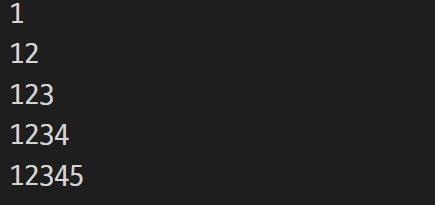

# 장윤신 - 기본문법 활용하기 연습문제

> 2022-08-22

<br>

## 문제 1

```js
for (let i = 0; i < 10; i++) {
  if (i % 2 == 1) {
    console.log(i);
  }
}
```


<br>

## 문제 2

```js
let i = 0;

while (i < 10) {
  
  if (i % 2 == 1) {
    console.log(i);
  }
  
  i++;
}
```


<br>

## 문제 3

```js
var sum = 0;

for (let i = 1; i < 20; i++) {
  if (i % 2 == 0 || i % 3 == 0) {
    sum += i;
    console.log("i=%d 총합=%d", i, sum);
  }
}
```


<br>

## 문제 4

```js
var cases = 0;

for (let i = 1; i <= 6; i++) {
  for (let j = 1; j <= 6; j++) {
    if (i + j == 6) {
      console.log("[ %d, %d ]", i, j)

      cases++;
    }
  }
}

console.log("경우의 수는 %d개 입니다", cases)
```


<br>

## 문제 5

```js

```


<br>

## 문제 6

```js
var sum = "";

for (i = 1; i < 6; i++) {
  sum += ("%d", i);
  console.log(sum);
}
```



<br>

## 문제 7

```js

```


