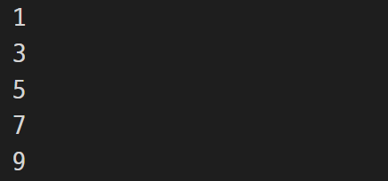
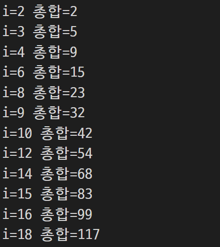
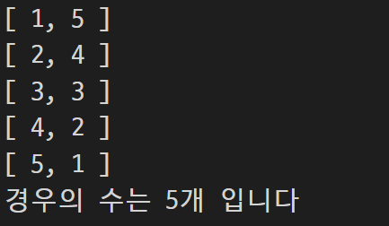
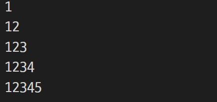

# 장윤신 - 기본문법 활용하기 연습문제

> 2022-08-22

<br>

## 문제 1

```js
// 문제를 잘못보고 큰수부터 출력해야하는걸 작은수부터 출력함

for (let i = 0; i < 10; i++) {
  if (i % 2 == 1) {
    console.log(i);
  }
}
```



<br>

## 문제 2

```js
// 문제를 잘못보고 큰수부터 출력해야하는걸 작은수부터 출력함

let i = 0;

while (i < 10) {
  
  if (i % 2 == 1) {
    console.log(i);
  }
  
  i++;
}
```


<br>

## 문제 3

```js
var sum = 0;

for (let i = 1; i < 20; i++) {
  if (i % 2 == 0 || i % 3 == 0) {
    sum += i;
    console.log("i=%d 총합=%d", i, sum);
  }
}

// 내 코드는 중간중간 더해지는 과정이 전부 출력되었는데 
// 풀이에선 console.log를 괄호 바깥 즉 맨 마지막 줄에 둬서 마지막 총합만을 출력
```



<br>

## 문제 4

```js
var cases = 0;

for (let i = 1; i <= 6; i++) {
  for (let j = 1; j <= 6; j++) {
    if (i + j == 6) {
      console.log("[ %d, %d ]", i, j)

      cases++;
    }
  }
}

console.log("경우의 수는 %d개 입니다", cases)

// 변수명을 case라고 하니 오류가 났다. 
// -> cases로 변경
```



<br>

## ※ 문제 5

```js
// 한줄에 4개씩 숫자를 넣는걸 테이블로 해야하나 했었는데 그냥 i가 한번 실행될때 그안의 문자열과 공백을 더하고 실행이 마무리 될때마다 console.log를 쓰는 식으로 줄바꿈을 표현하는 것이었다.

// 풀이에서 마지막 공백을 없애는 방법이 있는데 아직 어렵다.
// 1) 반복문의 조건식이 "변수 < 최대값" 인 경우의 조건 : 변수 + 1 < 최대값
```


<br>

## 문제 6

```js
let sum = "";

for (i = 1; i < 6; i++) {
  sum += ("%d", i);
  console.log(sum);
}

// 문제를 잘못보고 '중첩'반복문을 구현하지 않음

// 내가 쓴 코드는 같은 변수에 문자열을 계속 더해준다면
//(for문 바깥에서 선언)

// 풀이에서는 한싸이클마다 변수를 새로 초기화하고 문자열을 해당 개수만큼 그때마다 처음부터 더해주는식 
// (for문 안에서 선언)
```



<br>

## ※  문제 7

```js
// 처음부터 문제를 잘못 이해해서 number에 1또는 2를 넣는것을 어떻게 넣어야 하는지 몰랐었다.
```


