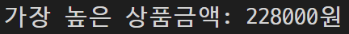
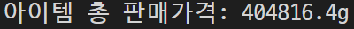

# 장윤신 - 배열 연습문제

> 2022-08-24

<br>

## 문제 1

```js
var check_list = [true, false, false, true, false];
console.log("before --> " + check_list);

for (i = 0; i < check_list.length; i++) {
  if (check_list[i] == true) {
    check_list[i] = false;
  } else {
    check_list[i] = true;
  }
}

console.log("after --> " + check_list);
```


<br>

--- 
<br>

## 문제 2

```js
var grade = [75, 82, 91];
var sum = 0, avg = 0;

// 총점 구하기
for (i = 0; i < grade.length; i++) {
  sum += grade[i];
}
console.log("총점 : %d", sum)

// 평균 구하기
avg = sum / (grade.length)
console.log("평균 : %d", avg)

// arr의 값을 소수점 둘째 자리 까지로 제한한다.
avg = avg.toFixed(2);
console.log("총점: " + sum + "점, 평균점수: " + avg + "점");

```


<br>

--- 
<br>

## 문제 3

```js
var time = [7, 5, 5, 5, 5, 10, 7];
var money = 0;

for (i = 0; i < time.length; i++) {
  if (i < 4) {
    money += time[i] * 4500
  } else {
    money += time[i] * 5200
  }
}

console.log("1주일간의 전체 급여: %d 원", money);
```


<br>

--- 
<br>

## 문제 4

```js
var price = [38000, 20000, 17900, 17900];
var qty = [6, 4, 3, 5];
var money = 0;

for (i = 0; i < price.length; i++) {
  money += price[i] * qty[i]
}

console.log("전체 결제 금액: %d 원", money)

```


<br>

--- 
<br>

## 문제 5

```js
let high_price = price[0] * qty[0];

for (i = 1; i < price.length; i++) {
  let price_qty = (price[i] * qty[i])

  if (high_price < (price_qty)) {
    let tmp = high_price
    high_price = (price_qty)
    price_qty = tmp
  }
}
console.log(high_price)
```



<br>

--- 
<br>

## 문제 6

```js
let free_shipping = 0;

for (i = 0; i < price.length; i++) {
  let price_qty = (price[i] * qty[i])

  if (price_qty >= 80000) {
    free_shipping += 1
  }
}

console.log("무료배송 항목: %d건", free_shipping)
```


<br>

--- 
<br>

## 문제 7

```js
var price = [209000, 109000, 119000, 109000, 94000];

console.log("상품가격 --> " + price);

for (var i = 0; i < (price.length - 1); i++) {
  // var j= i + 1 을 넣어야하는데 1을 넣어서 계속 다른값이 나왔었다.
  for (var j = i + 1; j < price.length; j++) {
    if (price[i] > price[j]) {
      var tmp = price[i];
      price[i] = price[j];
      price[j] = tmp;
    }
  }
}

console.log("낮은 가격순 --> " + price);
```


<br>

--- 
<br>

## 문제 8

```js
var arr = [5, 3, 2, 8, 9];
console.log('before --> ' + arr);

for (var i = 0; i < parseInt(arr.length / 2); i++) {
  var tmp = arr[i];
  arr[i] = arr[arr.length - i - 1];
  arr[arr.length - i - 1] = tmp;
}

console.log('after --> ' + arr);
```


<br>

--- 
<br>

## 문제 9

```js
/** 학생이름 배열 */
var student = ['둘리', '도우너', '또치', '희동'];

/** 성적표 배열 */
var grade = [
  [78, 89, 96],
  [62, 77, 67],
  [54, 90, 80],
  [100, 99, 98],
];

// 총점과 평균점수를 저장할 변수
var sum = 0, avg = 0;

/** 총점과 평균 구하기 */
for (i = 0; i < grade.length; i++) {
  for (j = 0; j < grade[i].length; j++) {
    sum += grade[i][j]
  }
  avg = sum / grade[i].length;
  avg = avg.toFixed(2);
  console.log("%s 총점: %d점, 평균: %d점", student[i], sum, avg);
  sum = 0;
}
```


<br>

--- 
<br>

## 문제 10

```js
// 총점과 평균점수를 저장할 변수
var sum = 0, avg = 0;
avg_class = 0;                              // 문제 10

/** 총점과 평균 구하기 */
for (i = 0; i < grade.length; i++) {
  for (j = 0; j < grade[i].length; j++) {
    sum += grade[i][j]
  }
  avg_class += sum / grade[i].length;       // 문제 10
  avg = sum / grade[i].length;
  avg = avg.toFixed(2);
  console.log("%s 총점: %d점, 평균: %d점", student[i], sum, avg);
  sum = 0;
}
avg_class = avg_class / student.length;     // 문제 10
console.log("반평균=%d점", avg_class);      // 문제 10
```


<br>

--- 
<br>

## 문제 11

```js
var price = [500, 320, 100, 120, 92, 30];
var qty = [291, 586, 460, 558, 18, 72];
var data = [price, qty];
var sum = 0;

for (i = 0; i < data[0].length; i++) {
  sum += data[0][i] * data[1][i];
}

console.log("아이템 총 판매가격: %dg", sum);

```


<br>

--- 
<br>

## 문제 12

```js
const ssn = [0, 1, 1, 2, 1, 3, 1, 0, 0, 0, 1, 2, 3];
let value = [2, 3, 4, 5, 6, 7, 8, 9, 2, 3, 4, 5];
let data = [ssn, value];

let sum = 0;

for (i = 0; i < data[1].length; i++) {
  sum += data[0][i] * data[1][i];
}
sum = sum % 11;
sum = (11 - sum) % 10;

if (sum == data[0][12]) {
  console.log("유효한 주민등록번호");
} else {
  console.log("유효하지 않은 주민등록번호");
}
```

