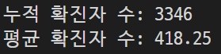

# 장윤신 - JSON 연습문제

> 2022-08-25

<br>

## 문제 1

```js
const blood = ['A', 'A', 'A', 'O', 'B', 'B', 'O', 'AB', 'AB', 'O'];
const result = { "A": 0, "B": 0, "AB": 0, "O": 0 };


for (var key of blood) {
  switch (key) {
    case 'A': result.A++
      break;
    case 'B': result.B++
      break;
    case 'AB': result.AB++
      break;
    case 'O': result.O++
      break;
  }
}

console.log(result);
```


<br>

--- 
<br>

## 문제 2-1

```js
const exam = {
  "철수": [89, 82, 79, 91],
  "민영": [91, 95, 94, 89],
  "남철": [65, 57, 71, 64],
  "혜진": [82, 76, 81, 83],
}


for (let x in exam) {
  let sum = 0;
  for (let y of exam[x]) {
    sum += y

  }
  let avg = sum / exam[x].length
  console.log("%s의 총점은 %d점 이고 평균은 %d점 입니다.", x, sum, avg)
}

```


<br>

--- 
<br>

## 문제 2-2

```js
var exam = {
  "철수": [89, 82, 79, 91],
  "민영": [91, 95, 94, 89],
  "남철": [65, 57, 71, 64],
  "혜진": [82, 76, 81, 83],
}

let sum = 0;
let count = 0;

for (let x in exam) {
  sum += exam[x][2]
  count++;
}

let avg = sum / count
console.log("모든 학생의 수학 총점은 %d점 이고 평균은 %d점 입니다.", sum, avg);
```


<br>

--- 
<br>

## 문제 3-1

```js
const covid19 = [
  { data: '0125', active: 426 },
  { data: '0126', active: 343 },
  { data: '0127', active: 547 },
  { data: '0128', active: 490 },
  { data: '0129', active: 460 },
  { data: '0130', active: 443 },
  { data: '0131', active: 338 },
  { data: '0201', active: 299 },
]

// 문제 3-1
let sum = 0;

for (let x of covid19) {
  sum += x.active
}
let avg = sum / covid19.length;
console.log("누적 확진자 수: %d", sum);
console.log("평균 확진자 수: %d", avg);
```



<br>

--- 
<br>

## 문제 3-2
```js
let max = covid19[0].active
let max_date = covid19[0].date

for (i = 1; i < covid19.length; i++) {
  if (max < covid19[i].active) {
    max = covid19[i].active
    max_date = covid19[i].date
  }

}

console.log("확진자가 가장 많이 나타난 날: %d", max_date);
```

