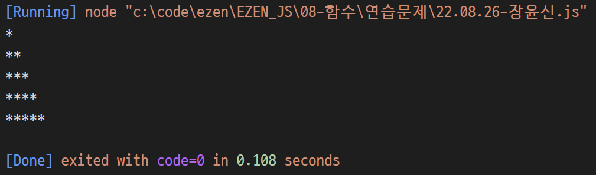
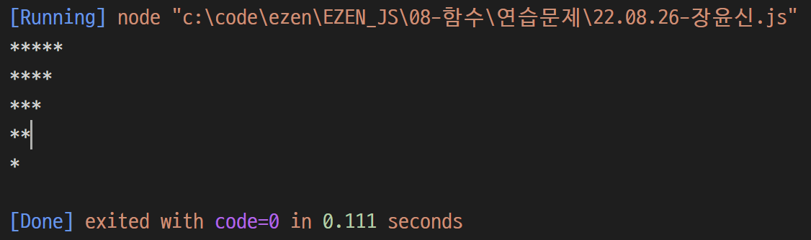
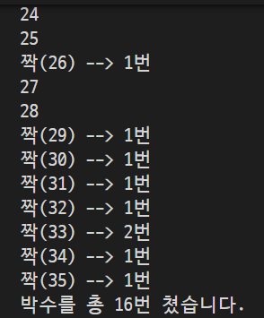
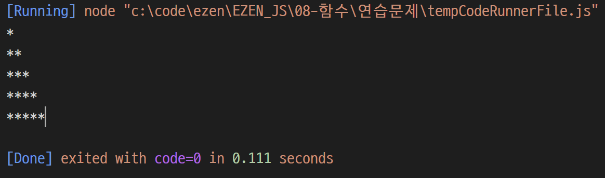
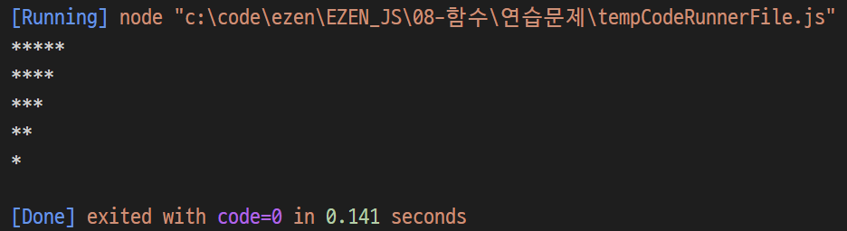

# 장윤신 - 함수 연습문제

> 2022-08-26

<br>

## 문제 1

```js
function printStar(max) {
  let count = "";
  for (i = 0; i < max; i++) {
    count = count + "*"
    console.log(count);
  }

}

printStar(5)
```



<br>

--- 
<br>

## 문제 2

```js
function printRevStar(max) {
  for (i = 0; i < max; i++) {
    let count = "";
    for (j = 0; j < max - i; j++) {
      count += "*";
    }
    console.log(count);
  }
}

printRevStar(5);
```



<br>

--- 
<br>

## 문제 3

```js
function myGame(n) {
    let clap = 0;

    for (i = 1; i <= n; i++) {
        let count = "" + i;
        let now_clap = 0;

        function f(x) {
            if (x > count.length - 1) {
                return now_clap;
            } else {
                if (count[x] == 3 || count[x] == 6 || count[x] == 9) {
                    clap++;
                    now_clap++;
                    return f(x + 1);
                } else {
                    return f(x + 1);
                }
            }
        }

        f(0);

        if (now_clap == 0) {
            console.log(count);
        } else {
            console.log("짝(%d) --> %d번", count, now_clap)
        }
    }
    
    console.log("박수를 총 %d번 쳤습니다.", clap);
}

myGame(35);

```



<br>

--- 
<br>

## 문제 4

```js
function printStar(max, current = 1) {
  if (current > max) {
    return;
  } else {
    let count = "";

    for (i = 0; i < current; i++) {
      count += "*";
    }
    
    console.log(count);
    printStar(max, current + 1);
  }
}
printStar(5);
```



<br>

--- 
<br>

## 문제 5

```js
function printRevStar(max, current = 1) {
  if (current > max) {
    return;
  } else {
    let count = "";

    for (i = 0; i < max - current + 1; i++) {
      count += "*";
    }

    console.log(count);
    printRevStar(max, current + 1);
  }
}

printRevStar(5);
```

