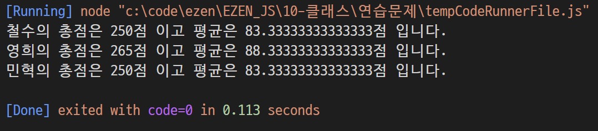
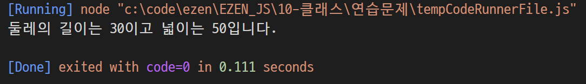
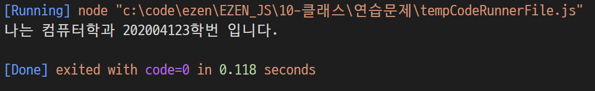
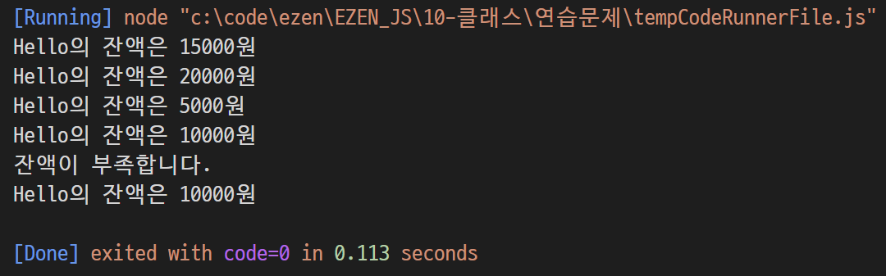
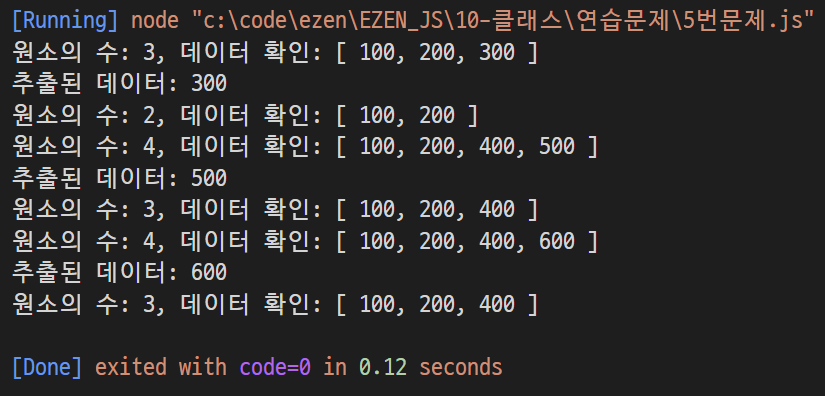
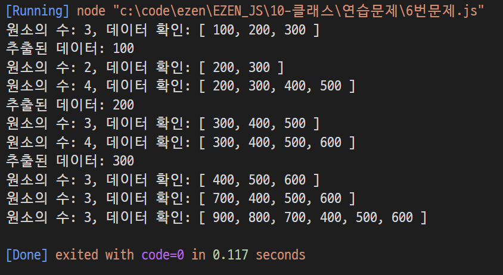

# 장윤신 - 클래스 연습문제

> 2022-08-31

<br>

## 문제 1

```js
class Student {
  #kor;
  #eng;
  #math;

  constructor(kor, eng, math) {
    this.#kor = kor;
    this.#eng = eng;
    this.#math = math;
  }

  get kor() {
    return this.#kor;
  }

  set kor(val) {
    this.#kor = val;
  }

  get eng() {
    return this.#eng;
  }

  set eng(val) {
    this.#eng = val;
  }

  get math() {
    return this.#math;
  }

  set math(val) {
    this.#math = val;
  }

  sum() {
    return this.kor + this.eng + this.math;
  }

  avg() {
    return this.sum() / 3;
  }
}

/** JSON */
const grade = [
  { 이름: "철수", 국어: 92, 영어: 81, 수학: 77 },
  { 이름: "영희", 국어: 72, 영어: 95, 수학: 98 },
  { 이름: "민혁", 국어: 80, 영어: 86, 수학: 84 },
];

for (const k of grade) {
  const s = new Student(k.국어, k.영어, k.수학);
  console.log("%s의 총점은 %d점 이고 평균은 %d점 입니다.", k.이름, s.sum(), s.avg());
}

/** 2차 배열 */
// const grade = [
//   ["철수", 92, 81, 77],
//   ["영희", 72, 95, 98],
//   ["민혁", 80, 86, 84],
// ];

// for (const k of grade) {
//   const s = new Student(k[1], k[2], k[3]);
//   console.log("%s의 총점은 %d점 이고 평균은 %d점 입니다.", k[0], s.sum(), s.avg());
// }
```



<br>

---

<br>

## 문제 2

```js
class Rectangle {
  #width;
  #height;

  constructor(width, height) {
    this.#width = width;
    this.#height = height;
  }

  get width() {
    return this.#width;
  }

  set width(val) {
    this.#width = val;
  }

  get height() {
    return this.#height;
  }

  set height(val) {
    this.#height = val;
  }

  getAround() {
    return (this.width + this.height) * 2;
  }

  getArea() {
    return this.width * this.height;
  }
}

const a = new Rectangle(10, 5);
console.log("둘레의 길이는 %d이고 넓이는 %d입니다.", a.getAround(), a.getArea());
```



<br>

---

<br>

## 문제 3

```js
class Student {
  #major;
  #id;

  constructor(major, id) {
    this.#major = major;
    this.#id = id;
  }

  get major() {
    return this.#major;
  }

  set major(val) {
    this.#major = val;
  }

  get id() {
    return this.#id;
  }

  set id(val) {
    this.#id = val;
  }

  sayHello() {
    console.log("나는 %s학과 %d학번 입니다.", this.major, this.id);
  }
}

const stud = new Student("컴퓨터", 202004123);
stud.sayHello();
```



<br>

---

<br>

## 문제 4

```js
class Account {
  #owner;
  #balance;

  constructor(owner, balance) {
    this.#owner = owner;
    this.#balance = balance;
  }

  get owner() {
    return this.#owner;
  }

  set owner(val) {
    this.#owner = val;
  }

  get balance() {
    return this.#balance;
  }

  set balance(val) {
    this.#balance = val;
  }

  deposit(amount) {
    return (this.balance += amount);
  }

  withdraw(long) {
    if (this.balance < long) {
      console.log("잔액이 부족합니다.");
      return;
    }
    return (this.balance -= long);
  }
}

const acc = new Account("Hello", 15000);
console.log("%s의 잔액은 %d원", acc.owner, acc.balance);

acc.deposit(5000);
console.log("%s의 잔액은 %d원", acc.owner, acc.balance);

acc.withdraw(15000);
console.log("%s의 잔액은 %d원", acc.owner, acc.balance);

acc.deposit(5000);
console.log("%s의 잔액은 %d원", acc.owner, acc.balance);

acc.withdraw(15000);
console.log("%s의 잔액은 %d원", acc.owner, acc.balance);
```



<br>

---

<br>

## 문제 5

```js
class MyList {
  #data;
  #size;

  constructor() {
    this.#data = [];
    this.#size = 0;
  }

  get data() {
    return this.#data;
  }

  get size() {
    return this.#size;
  }

  push(val) {
    this.#data[this.data.length] = val;
    this.#size++;
    return;
  }

  // 만약 data가 =
  // 앞에있다면 : set data = ~~~ (값을 설정)
  // 뒤에있다면 : ~~~ = get data (값을 리턴받음)
  // 따라서 위에서 set을 설정안했으므로 아래에선 =앞의 data와 size는 #을 붙여야함.
  pop() {
    let x = this.data[this.data.length - 1];
    // 임시변수 tmp는 data보다 1축소된 배열
    let tmp = [];
    for (let i = 0; i < this.data.length - 1; i++) {
      tmp[i] = this.data[i];
    }

    this.#data = [];
    for (let j = 0; j < tmp.length; j++) {
      this.data[j] = tmp[j];
    }
    this.#size--;

    return x;
  }
}

//
//
const list = new MyList();

list.push(100);
list.push(200);
list.push(300);
console.log("원소의 수: %d, 데이터 확인: %s", list.size, list.data);

const x = list.pop();
console.log("추출된 데이터: %d", x);
console.log("원소의 수: %d, 데이터 확인: %s", list.size, list.data);

list.push(400);
list.push(500);
console.log("원소의 수: %d, 데이터 확인: %s", list.size, list.data);

const y = list.pop();
console.log("추출된 데이터: %d", y);
console.log("원소의 수: %d, 데이터 확인: %s", list.size, list.data);

list.push(600);
console.log("원소의 수: %d, 데이터 확인: %s", list.size, list.data);

const z = list.pop();
console.log("추출된 데이터: %d", z);
console.log("원소의 수: %d, 데이터 확인: %s", list.size, list.data);
```


<br>

---

<br>

## 문제 6

```js
class MyList {
  #data;
  #size;

  constructor() {
    this.#data = [];
    this.#size = 0;
  }

  get data() {
    return this.#data;
  }

  get size() {
    return this.#size;
  }

  push(val) {
    this.#data[this.#data.length] = val;
    this.#size++;
    return;
  }

  // 만약 data가 =
  // 앞에있다면 : set data = ~~~ (값을 설정)
  // 뒤에있다면 : ~~~ = get data (값을 리턴받음)
  // 따라서 위에서 set을 설정안했으므로 아래에선 =앞의 data와 size는 #을 붙여야함.
  pop() {
    let x = this.data[this.data.length - 1];
    // 임시변수 tmp는 data보다 1축소된 배열
    let tmp = [];
    for (let i = 0; i < this.data.length - 1; i++) {
      tmp[i] = this.data[i];
    }

    this.#data = [];
    for (let j = 0; j < tmp.length; j++) {
      this.data[j] = tmp[j];
    }
    this.#size--;

    return x;
  }

  //----------------------------------------------------------
  // 문제 6
  shift() {
    let y = this.data[0];

    let tmp = [];
    for (let i = 1; i < this.data.length; i++) {
      tmp[i - 1] = this.data[i];
    }

    this.#data = [];
    for (let j = 0; j < tmp.length; j++) {
      this.data[j] = tmp[j];
    }
    this.#size--;

    return y;
  }

  unshift(item) {
    let tmp = [];
    for (let i = 0; i < this.data.length; i++) {
      tmp[i] = this.data[i];
    }

    this.#data[this.data.length] = 0;
    this.#data[0] = item;
    for (let j = 0; j < this.data.length - 1; j++) {
      this.#data[j + 1] = tmp[j];
    }
  }
}
const list = new MyList();

list.push(100);
list.push(200);
list.push(300);
console.log("원소의 수: %d, 데이터 확인: %s", list.size, list.data);

const x = list.shift();
console.log("추출된 데이터: %d", x);
console.log("원소의 수: %d, 데이터 확인: %s", list.size, list.data);

list.push(400);
list.push(500);
console.log("원소의 수: %d, 데이터 확인: %s", list.size, list.data);

const y = list.shift();
console.log("추출된 데이터: %d", y);
console.log("원소의 수: %d, 데이터 확인: %s", list.size, list.data);

list.push(600);
console.log("원소의 수: %d, 데이터 확인: %s", list.size, list.data);

const z = list.shift();
console.log("추출된 데이터: %d", z);
console.log("원소의 수: %d, 데이터 확인: %s", list.size, list.data);

list.unshift(700);
console.log("원소의 수: %d, 데이터 확인: %s", list.size, list.data);

list.unshift(800);
list.unshift(900);
console.log("원소의 수: %d, 데이터 확인: %s", list.size, list.data);
```


