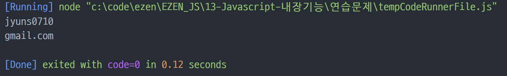
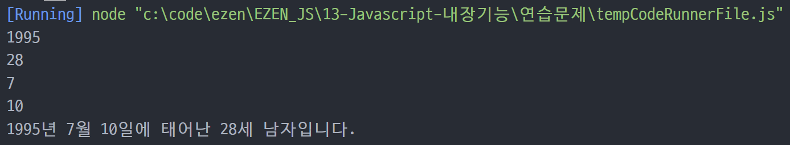
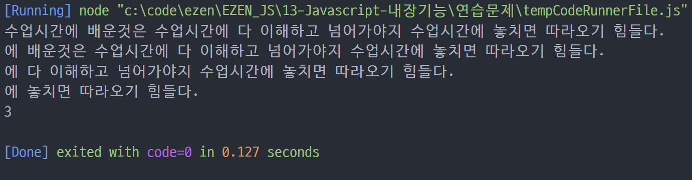
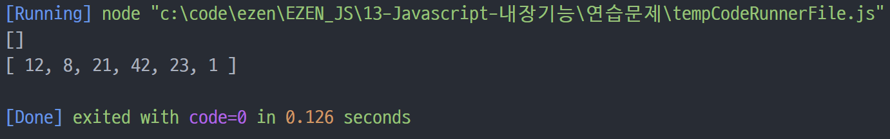
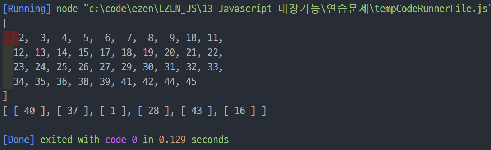
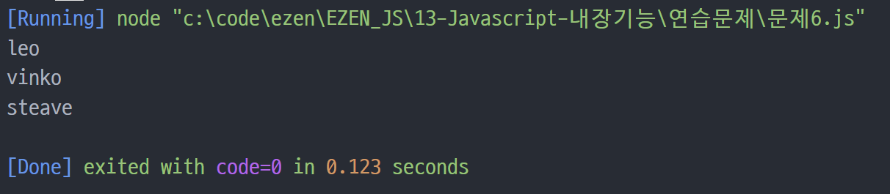

# 장윤신 - 내장기능 연습문제

> 2022-09-02

<br>

## 문제 1

```js
const email = "jyuns0710@gmail.com";
const spl = email.split("@");
console.log(spl[0]);
console.log(spl[1]);
```



<br>

---

<br>

## 문제 2

```js
const ssn = "950710-1******";
const now_year = 2022;

let yc = ssn[0] + ssn[1];

let birth;
let gender = "남자";
if (ssn[7] == 1) {
  birth = parseInt("19" + yc);
} else if (ssn[7] == 2) {
  birth = parseInt("19" + yc);
  gender = "여자";
} else if (ssn[7] == 3) {
  birth = parseInt("20" + yc);
} else {
  birth = parseInt("20" + yc);
  gender = "여자";
}

console.log(birth);
let year = now_year - birth + 1;
console.log(year);

let bM = 0;

if (ssn[2] == 0) {
  bM = ssn[3];
} else {
  bM += "1" + ssn[3];
}
console.log(bM);

let bD = "";
if (ssn[4] == 0) {
  bD += ssn[5];
} else {
  bD += ssn[4] + ssn[5];
}
console.log(bD);

console.log("%d년 %d월 %d일에 태어난 %d세 %s입니다.", birth, bM, bD, year, gender);
```



<br>

---

<br>

## 문제 3

```js
str = "수업시간에 배운것은 수업시간에 다 이해하고 넘어가야지 수업시간에 놓치면 따라오기 힘들다.";

word = "수업시간";
flen = word.length;
find = true;
count = 0;

while (find) {
  console.log(str);
  p = str.indexOf(word);
  find = p > -1;

  if (find) {
    count++;
    str = str.substring(p + flen);
  }
}
console.log(count);
```



<br>

---

<br>

## 문제 4

```js
function random(n1, n2) {
  return parseInt(Math.random() * (n2 - n1 + 1)) + n1;
}

const lotto = [];
console.log(lotto);

for (i = 0; i < 6; i++) {
  while (true) {
    const rnd = random(1, 45);

    if (!lotto.includes(rnd)) {
      lotto.push(rnd);
      break;
    }
  }
}
console.log(lotto);
```



<br>

---

<br>

## 문제 5

```js
function random(n1, n2) {
  return parseInt(Math.random() * (n2 - n1 + 1)) + n1;
}

// balls 생성
const balls = [];
for (i = 0; i < 45; i++) {
  balls[i] = i + 1;
}
// lotto2 빈칸 생성
const lotto2 = new Array(6);
// lotto의 i번째 인덱스에 balls[0~44중에 랜덤한 인덱스]를 뺴옴
for (i = 0; i < 6; i++) {
  lotto2[i] = balls.splice(random(0, balls.length - 1), 1);
}

console.log(balls);
console.log(lotto2);
```



<br>

---

<br>

## 문제 6

```js
// par[i]번째 원소가 comp에 있는지 탐색
// 없다고 하면 par[i] return;
// par[0~par.length]까지 반복
function solution(participant, completion) {
  var answer = "";
  for (i = 0; i < participant.length; i++) {
    if (!completion.includes(participant[i])) {
      answer = participant[i];
      break;
    }
  }
  return answer;
}

// "leo"는 참여자 명단에는 있지만, 완주자 명단에는 없기 때문에 완주하지 못했습니다.
// 출력결과: "leo"가 출력
console.log(solution(["leo", "kiki", "eden"], ["eden", "kiki"]));
// "vinko"는 참여자 명단에는 있지만, 완주자 명단에는 없기 때문에 완주하지 못했습니다.
// 출력결과: "vinko"가 출력
console.log(solution(["marina", "josipa", "nikola", "vinko", "filipa"], ["josipa", "filipa", "marina", "nikola"]));
// "steave"는 참여자 명단에는 있지만, 완주자 명단에는 없기 때문에 완주하지 못했습니다.
// 출력결과: "steave"가 출력
console.log(solution(["mislav", "stanko", "steave", "ana"], ["stanko", "ana", "mislav"]));
```


