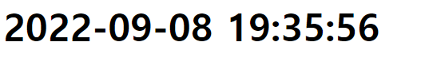
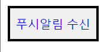
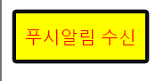
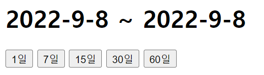
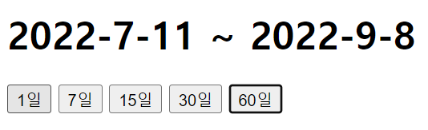

# 장윤신 - HTML제어하기 연습문제

> 2022-09-08

<br>

## 문제 1

```html
<!DOCTYPE html>
<html lang="ko">
  <head>
    <meta charset="UTF-8" />
    <meta http-equiv="X-UA-Compatible" content="IE=edge" />
    <meta name="viewport" content="width=device-width, initial-scale=1.0" />
    <title>Document</title>
  </head>
  <body>
    <h1 id="clock"></h1>
    <script>
      function watch() {
        let date1 = new Date();

        let yyyy = date1.getFullYear();

        let mm = date1.getMonth() + 1;
        if (mm < 10) {
          mm = "0" + mm;
        }

        let dd = date1.getDate();
        if (dd < 10) {
          dd = "0" + dd;
        }

        let hh = date1.getHours();
        if (hh < 10) {
          hh = "0" + hh;
        }

        let mi = date1.getMinutes();
        if (mi < 10) {
          mi = "0" + mi;
        }

        let ss = date1.getSeconds();
        if (ss < 10) {
          ss = "0" + ss;
        }
        document.querySelector("#clock").innerHTML = `${yyyy}-${mm}-${dd} ${hh}:${mi}:${ss}`;
        console.log("hi");
      }

      setInterval(watch, 1000);
    </script>
  </body>
</html>
```



<br>

---

<br>

## 문제 2

```html
<!DOCTYPE html>
<html lang="ko">
  <head>
    <meta charset="UTF-8" />
    <meta http-equiv="X-UA-Compatible" content="IE=edge" />
    <meta name="viewport" content="width=device-width, initial-scale=1.0" />
    <title>Document</title>
    <style>
      .push {
        color: blue;
        height: 40px;
        border: 3px solid black;
      }
      .active {
        color: red;
        background-color: yellow;
      }
    </style>
  </head>
  <body>
    <button type="button" class="push">푸시알림 수신</button>

    <script>
      document.querySelector(".push").addEventListener("click", (e) => {
        e.target.classList.toggle("active");
      });
    </script>
  </body>
</html>
```




<br>

---

<br>

## 문제 3

```html
<!DOCTYPE html>
<html lang="ko">
  <head>
    <meta charset="UTF-8" />
    <meta http-equiv="X-UA-Compatible" content="IE=edge" />
    <meta name="viewport" content="width=device-width, initial-scale=1.0" />
    <title>Document</title>
  </head>
  <body>
    <h1 class="cal"><span class="date" id="s_date"></span> ~ <span class="date" id="e_date"></span></h1>
    <input type="button" class="btn" data-date="1" value="1일" />
    <input type="button" class="btn" data-date="7" value="7일" />
    <input type="button" class="btn" data-date="15" value="15일" />
    <input type="button" class="btn" data-date="30" value="30일" />
    <input type="button" class="btn" data-date="60" value="60일" />

    <script>
      const todayDate = new Date();
      document.querySelectorAll(".date").forEach((v, i) => {
        v.innerHTML = todayDate.getFullYear() + "-" + (todayDate.getMonth() + 1) + "-" + todayDate.getDate();
      });

      document.querySelectorAll(".btn").forEach((v, i) => {
        v.addEventListener("click", (e) => {
          const startDate = new Date();
          let vdd = v.dataset.date;

          startDate.setDate(startDate.getDate() - vdd);

          document.querySelector("#s_date").innerHTML = startDate.getFullYear() + "-" + (startDate.getMonth() + 1) + "-" + startDate.getDate();
        });
      });
    </script>
  </body>
</html>
```



