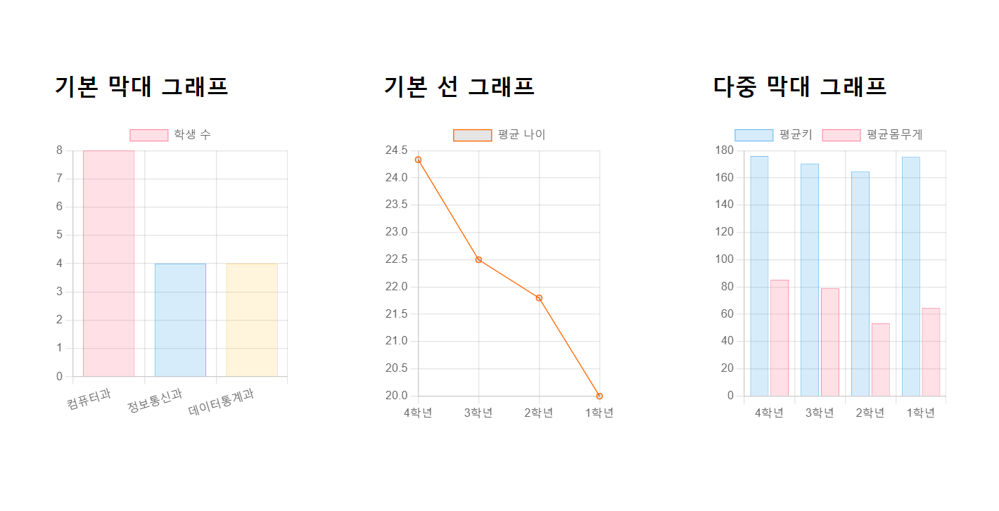

# 장윤신 - 라이브러리 활용 chart.js 연습문제

> 2022-09-15

<br>

## 문제 1

```html
<!DOCTYPE html>
<html lang="ko">
  <head>
    <meta charset="UTF-8" />
    <meta http-equiv="X-UA-Compatible" content="IE=edge" />
    <meta name="viewport" content="width=device-width, initial-scale=1.0" />
    <title>Document</title>
    <style>
      .subplot {
        float: left;
        width: 33.3%;
        padding: 50px;
        box-sizing: border-box;
      }

      .subplot-item {
        width: auto;
        height: 320px;
      }
    </style>
  </head>
  <body>
    <div class="subplot">
      <h2>기본 막대 그래프</h2>
      <div class="subplot-item"><canvas id="mychart1"></canvas></div>
    </div>
    <div class="subplot">
      <h2>기본 선 그래프</h2>
      <div class="subplot-item"><canvas id="mychart2"></canvas></div>
    </div>
    <div class="subplot">
      <h2>다중 막대 그래프</h2>
      <div class="subplot-item"><canvas id="mychart3"></canvas></div>
    </div>

    <script type="text/javascript" src="./dataset/dataset.js"></script>
    <script type="text/javascript" src="../../node_modules/chart.js/dist/chart.min.js"></script>
    <script>
      const id = [];
      const name = [];
      const grade = [];
      const birthdate = [];
      const height = [];
      const weight = [];
      const deptno = [];

      for (k in student) {
        id.push(student[k]["id"]);
        name.push(student[k]["name"]);
        grade.push(student[k]["grade"]);
        birthdate.push(student[k]["birthdate"]);
        height.push(student[k]["height"]);
        weight.push(student[k]["weight"]);
        deptno.push(student[k]["deptno"]);
      }

      /** 문제1 - 세로 막대 그래프 (학과별 학생 수) */
      console.group("문제1");
      let major = {};
      for (i = 0; i < deptno.length; i++) {
        major[deptno[i]] ? major[deptno[i]]++ : (major[deptno[i]] = 1);
      }
      let m1 = [];
      let m2 = [];
      for (key in major) {
        m1.push(key);
        m2.push(major[key]);
      }

      const mychart1 = document.getElementById("mychart1");
      const mychart2 = document.getElementById("mychart2");
      const mychart3 = document.getElementById("mychart3");

      new Chart(mychart1, {
        type: "bar",
        data: {
          labels: m1,
          datasets: [
            {
              label: "학생 수",
              data: m2,
              borderWidth: 0.5,
              backgroundColor: ["rgba(255, 99, 132, 0.2)", "rgba(54, 162, 235, 0.2)", "rgba(255, 206, 86, 0.2)"],
              borderColor: ["rgba(255, 99, 132, 1)", "rgba(54, 162, 235, 1)", "rgba(255, 206, 86, 1)"],
            },
          ],
        },
        options: {
          maintainAspectRatio: false,
          scales: {
            y: {
              beginAtZero: true,
            },
          },
        },
      });
      console.groupEnd();

      /** 문제2 - 선그래프 (학년별 평균 나이) */
      console.group("문제2");
      console.log(birthdate);
      let year = [];
      for (yy in birthdate) {
        year.push(2022 - +birthdate[yy].split("-")[0] + 1);
        console.log(birthdate[yy]);
      }

      console.log(grade);
      console.log(year);
      const ageInfo = {
        "4학년": [],
        "3학년": [],
        "2학년": [],
        "1학년": [],
      };
      for (i = 0; i < year.length; i++) {
        if (grade[i] == 4) {
          ageInfo["4학년"].push(year[i]);
        } else if (grade[i] == 3) {
          ageInfo["3학년"].push(year[i]);
        } else if (grade[i] == 2) {
          ageInfo["2학년"].push(year[i]);
        } else if (grade[i] == 1) {
          ageInfo["1학년"].push(year[i]);
        }
      }

      // 평균 나이 (가로축)
      const avg = [];
      // 학년 (x축)
      const ggg = [];

      console.log(ageInfo);
      for (key in ageInfo) {
        console.log(ageInfo[key]);
        ggg.push(key);
        let sum = ageInfo[key].reduce((a, c) => {
          return (a = a + c);
        });
        console.log(sum);
        avg.push(sum / ageInfo[key].length);
      }
      console.log(avg);
      console.log(ggg);

      new Chart(mychart2, {
        type: "line",
        data: {
          labels: ggg,
          datasets: [
            {
              label: "평균 나이",
              data: avg,
              borderWidth: 1,
              borderColor: "#ff6600",
            },
          ],
        },
        options: {
          maintainAspectRatio: false,
        },
      });
      console.groupEnd();

      /** 문제3 - 세로 다중 막대 그래프 (학년별 평균키,평균몸무게) */
      console.group("문제 3");
      console.log(grade);
      console.log(height);
      console.log(weight);

      const g4 = { height: [1] };
      console.log(g4.height);
      const bodyInfo = {
        "4학년": { height: [], weight: [] },
        "3학년": { height: [], weight: [] },
        "2학년": { height: [], weight: [] },
        "1학년": { height: [], weight: [] },
      };
      for (i = 0; i < year.length; i++) {
        if (grade[i] == 4) {
          bodyInfo["4학년"].height.push(height[i]);
          bodyInfo["4학년"].weight.push(weight[i]);
        } else if (grade[i] == 3) {
          bodyInfo["3학년"].height.push(height[i]);
          bodyInfo["3학년"].weight.push(weight[i]);
        } else if (grade[i] == 2) {
          bodyInfo["2학년"].height.push(height[i]);
          bodyInfo["2학년"].weight.push(weight[i]);
        } else if (grade[i] == 1) {
          bodyInfo["1학년"].height.push(height[i]);
          bodyInfo["1학년"].weight.push(weight[i]);
        }
      }

      console.log(bodyInfo);

      // 학년별 평균 키와 평균 몸무게
      let hSum = 0;
      let wSum = 0;
      let hAvg = [];
      let wAvg = [];
      for (key in bodyInfo) {
        hSum = bodyInfo[key].height.reduce((a, c) => {
          return (a = a + c);
        });
        wSum = bodyInfo[key].weight.reduce((a, c) => {
          return (a = a + c);
        });

        hAvg.push(hSum / bodyInfo[key].height.length);
        wAvg.push(wSum / bodyInfo[key].weight.length);
      }
      console.log("평균키" + hAvg);
      console.log("평균몸무게" + wAvg);

      new Chart(mychart3, {
        type: "bar",
        data: {
          labels: ggg,
          datasets: [
            {
              label: "평균키",
              data: hAvg,
              borderWidth: 0.5,
              borderColor: "rgba(54,162,235,1)",
              backgroundColor: "rgba(54,162,235,0.2)",
            },
            {
              label: "평균몸무게",
              data: wAvg,
              borderWidth: 0.5,
              borderColor: "rgba(255,99,132,1)",
              backgroundColor: "rgba(255,99,132,0.2)",
            },
          ],
        },
        options: {
          maintainAspectRatio: false,
          scales: {
            y: {
              beginAtZero: true,
            },
          },
        },
      });
      console.groupEnd();
    </script>
  </body>
</html>
```


