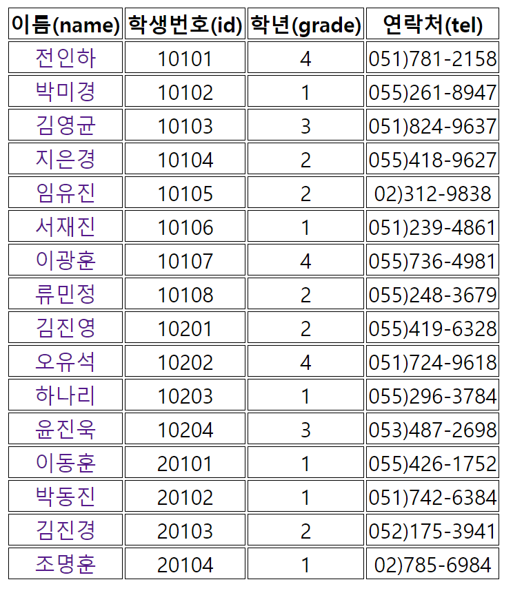
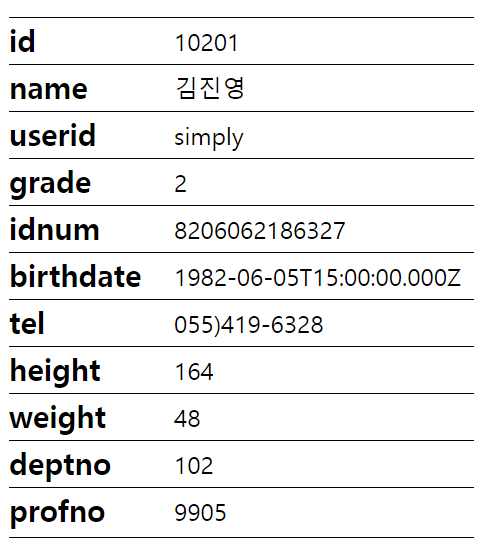

# 장윤신 - Ajax 연습문제

> 2022-09-30

<br>

## 코드

### student_list.html 코드

```html
<!DOCTYPE html>
<html lang="ko">
  <head>
    <meta charset="UTF-8" />
    <meta http-equiv="X-UA-Compatible" content="IE=edge" />
    <meta name="viewport" content="width=device-width, initial-scale=1.0" />
    <title>Document</title>
  </head>
  <style>
    td,
    th {
      border: 1px solid black;
      text-align: center;
      font-size: 20px;
    }
    a {
      text-decoration: none;
    }
  </style>

  <body>
    <table id="table">
      <tbody id="tbody">
        <tr>
          <th>이름(name)</th>
          <th>학생번호(id)</th>
          <th>학년(grade)</th>
          <th>연락처(tel)</th>
        </tr>
      </tbody>
    </table>

    <script type="module">
      import ajaxHelper from "../../helper/AjaxHelper.js";
      const tbody = document.querySelector(".tbody");

      (async (e) => {
        let json = null;

        try {
          json = await ajaxHelper.requestAsync("http://localhost:3001/student");
          console.log(json);
        } catch (e) {
          console.error(e);
          alert(`[${e.status}] ${e.text}\n${e.msg}`);
          return;
        }

        console.log(json);

        json.forEach((v, i) => {
          const tr = document.createElement("tr");
          const tdName = document.createElement("td");
          const nameLink = document.createElement("a");
          const tdId = document.createElement("td");
          const tdGrade = document.createElement("td");
          const tdTel = document.createElement("td");

          // 이름
          nameLink.innerHTML = v.name;
          // nameLink.setAttribute("href", "http://localhost:3001/student/" + v.id);
          nameLink.setAttribute("href", "#");
          nameLink.classList.add("btn");
          nameLink.setAttribute("data-id", v.id);
          tdName.appendChild(nameLink);
          tr.appendChild(tdName);

          // 번호, 학년, 연락처
          tdId.innerHTML = v.id;
          tr.appendChild(tdId);
          tdGrade.innerHTML = v.grade;
          tr.appendChild(tdGrade);
          tdTel.innerHTML = v.tel;
          tr.appendChild(tdTel);

          document.querySelector("#tbody").appendChild(tr);
        });
        document.querySelectorAll(".btn").forEach((v2, i2) => {
          v2.addEventListener("click", (e) => {
            e.preventDefault();

            console.log(v2.dataset.id);
            const ID = "ID";
            sessionStorage.setItem(ID, v2.dataset.id);
            location.href = "student_info.html";
          });
        });
      })();
    </script>
    <script></script>
  </body>
</html>
```

<br>

### student_info.html 코드

```html
<!DOCTYPE html>
<html lang="ko">
  <head>
    <meta charset="UTF-8" />
    <meta http-equiv="X-UA-Compatible" content="IE=edge" />
    <meta name="viewport" content="width=device-width, initial-scale=1.0" />
    <title>Document</title>
    <style>
      dt {
        font-size: 20px;
        font-weight: bold;
        border-top: 1px solid black;
        width: 310px;
        position: absolute;
      }

      dt:last-of-type {
        border-bottom: 1px solid black;
        padding-bottom: 5px;
      }

      dd {
        font-size: 16px;
        padding: 5px 0 5px 70px;
        position: relative;
      }
    </style>
  </head>
  <body>
    <dl id="console"></dl>
    <script type="module">
      import ajaxHelper from "../../helper/AjaxHelper.js";

      const read = document.querySelector("#read");
      const ID = sessionStorage.getItem("ID");

      let json = null;

      (async () => {
        try {
          json = await ajaxHelper.requestAsync("http://localhost:3001/student/" + ID);
        } catch (e) {
          console.error(e);
          alert(`[${e.status}] ${e.text}\n${e.msg}`);
          return;
        }

        console.log(json);
        for (let key in json) {
          const dt = document.createElement("dt");
          dt.innerHTML = key;
          document.querySelector("#console").appendChild(dt);
          const dd = document.createElement("dd");
          dd.innerHTML = json[key];
          document.querySelector("#console").appendChild(dd);
        }
      })();
    </script>
  </body>
</html>
```

<br>
<br>
<br>

## 결과 스크린샷


_student_list.html_

<br>

  
 _student_info.html_
