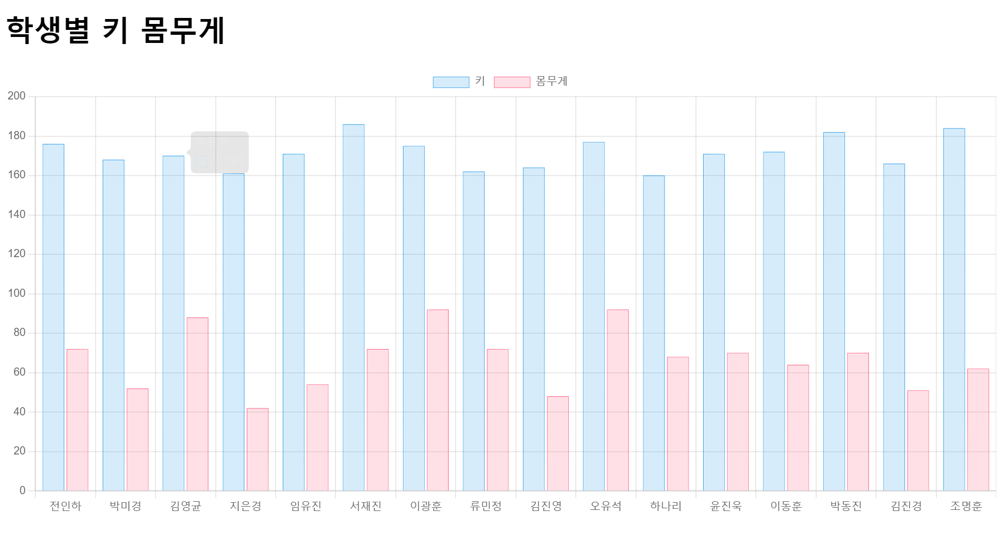

# 장윤신 - Javascript-Ajax(Student 키,몸무게) 연습문제

> 2022-10-04

<br>

## 코드

```html
<!DOCTYPE html>
<html lang="ko">
  <head>
    <meta charset="UTF-8" />
    <meta http-equiv="X-UA-Compatible" content="IE=edge" />
    <meta name="viewport" content="width=device-width, initial-scale=1.0" />
    <title>Document</title>
    <style>
      #chart {
        height: 500px;
      }
    </style>
  </head>
  <body>
    <h1>학생별 키 몸무게</h1>
    <div><canvas id="chart"></canvas></div>

    <script src="../../node_modules/axios/dist/axios.min.js"></script>
    <script src="../../node_modules/chart.js/dist/chart.min.js"></script>
    <script>
      (async () => {
        let json = null;

        try {
          const response = await axios.get(`http://localhost:3001/student`);
          json = response.data;
        } catch (error) {
          console.error(`[Error Code] ${error.code}`);
          console.error(`[Error Message] ${error.message}`);
          let alertMsg = error.message;
          if (error.message !== undefined) {
            const erroeMsg = `${error.response.status} error - ${error.response.statusText}`;
            console.error(`[HTTP Status] ${errorMsg}`);
            alertMsg += `\n${errorMsg}`;
          }
          alert(alertMsg);
          return;
        }

        const name = [];
        const height = [];
        const weight = [];

        json.forEach((v, i) => {
          name.push(v.name);
          height.push(v.height);
          weight.push(v.weight);
        });

        new Chart(chart, {
          type: "bar",
          data: {
            labels: name,
            datasets: [
              {
                label: "키",
                data: height,
                borderWidth: 0.5,
                borderColor: "rgba(54,162,235,1)",
                backgroundColor: "rgba(54,162,235,0.2)",
              },
              {
                label: "몸무게",
                data: weight,
                borderWidth: 0.5,
                borderColor: "rgba(255,99,132,1)",
                backgroundColor: "rgba(255,99,132,0.2)",
              },
            ],
          },
          options: {
            maintainAspectRatio: false,
            scales: {
              y: {
                beginAtZero: true,
              },
            },
          },
        });
      })();
    </script>
  </body>
</html>
```

## 결과 스크린샷


