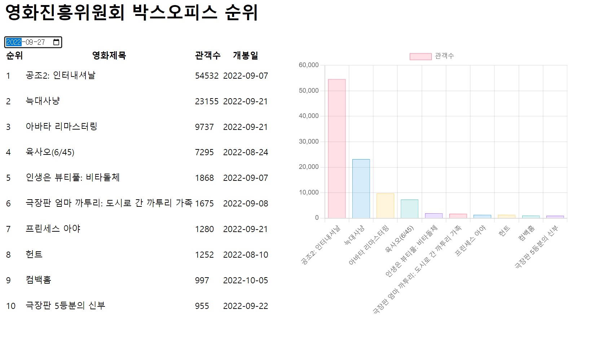

# 장윤신 - Javascript-Ajax(영화진흥위원회) 연습문제

> 2022-10-04

<br>

## 코드

```html
<!DOCTYPE html>
<html lang="ko">
  <head>
    <meta charset="UTF-8" />
    <meta http-equiv="X-UA-Compatible" content="IE=edge" />
    <meta name="viewport" content="width=device-width, initial-scale=1.0" />
    <title>Document</title>
    <style>
      #container {
        display: flex;
      }

      #loading {
        width: 100px;
        height: 100px;
        background: url(img/loading.gif) no-repeat/cover;
        position: absolute;
        left: 50%;
        top: 50%;
        transform: translate(-50%, -50%);
        z-index: 999999;
        display: none;
      }

      #loading.active {
        display: block;
      }

      canvas {
        height: 500px;
        width: 500px;
        margin-left: 50px;
      }
    </style>
  </head>
  <body>
    <div id="loading"></div>
    <h1>영화진흥위원회 박스오피스 순위</h1>

    <input type="date" id="targetDt" />

    <div id="container">
      <table>
        <thead>
          <tr>
            <th>순위</th>
            <th>영화제목</th>
            <th>관객수</th>
            <th>개봉일</th>
          </tr>
        </thead>
        <tbody id="list-body"></tbody>
      </table>

      <div class="subplot-item"></div>
    </div>

    <script src="../node_modules/axios/dist/axios.min.js"></script>
    <script src="../node_modules/chart.js/dist/chart.min.js"></script>
    <script>
      const getMovieRank = async (targetDt) => {
        const loading = document.querySelector("#loading");
        loading.classList.add("active");

        let json = null;

        try {
          const response = await axios.get(" http://www.kobis.or.kr/kobisopenapi/webservice/rest/boxoffice/searchDailyBoxOfficeList.json", {
            params: {
              key: "aac17f5c64e5bce4d2fad9a552b7b952",
              targetDt: targetDt.replaceAll("-", ""),
            },
          });

          json = response.data;
        } catch (error) {
          console.error(`[Error Code] ${error.code}`);
          console.error(`[Error Message] ${error.message}`);
          let alertMsg = error.message;

          if (error.message !== undefined) {
            const erroeMsg = `${error.response.status} error - ${error.response.statusText}`;
            console.error(`[HTTP Status] ${errorMsg}`);
            alertMsg += `\n${errorMsg}`;
          }

          alert(alertMsg);
          return;
        } finally {
          loading.classList.remove("active");
        }

        const state = { targetDt: targetDt, data: JSON.stringify(json) };
        const url = `${location.pathname}?targetDt=${targetDt}`;
        history.pushState(state, null, url);

        renderMovieRank(json);
        renderMovieChart(json);
      };

      /**
       * JSON 데이터를 테이블에 출력한다.
       * 기존에 출력되고 있던 항목은 삭제한다.
       */
      const renderMovieRank = (json) => {
        const listBody = document.querySelector("#list-body");

        Array.from(listBody.getElementsByTagName("tr")).map((v, i) => {
          listBody.removeChild(v);
        });

        if (json) {
          json.boxOfficeResult.dailyBoxOfficeList.forEach((v, i) => {
            const tr = document.createElement("tr");
            listBody.appendChild(tr);

            const td1 = document.createElement("td");
            td1.innerHTML = v.rank;
            tr.appendChild(td1);

            const td2 = document.createElement("td");
            td2.innerHTML = v.movieNm;
            tr.appendChild(td2);

            const td3 = document.createElement("td");
            td3.innerHTML = v.audiCnt;
            tr.appendChild(td3);

            const td4 = document.createElement("td");
            td4.innerHTML = v.openDt;
            tr.appendChild(td4);
          });
        }
      };

      /** 날짜값이 변경된 경우에 대한 이벤트 */
      document.querySelector("#targetDt").addEventListener("change", (e) => {
        getMovieRank(e.currentTarget.value);
      });

      /** history가 이전 페이지로 되돌아 갈 때 발생하는 이벤트 */
      window.addEventListener("popstate", (e) => {
        if (e.state) {
          const json = JSON.parse(e.state.data);
          renderMovieRank(json);
          renderMovieChart(json);
          document.querySelector("#targetDt").value = e.state.targetDt;
        } else {
          renderMovieRank();
          renderMovieChart();
          document.querySelector("#targetDt").value = "";
        }
      });

      const renderMovieChart = (json) => {
        const subplotItem = document.querySelector(".subplot-item");
        if (subplotItem.children) {
          Array.from(subplotItem.children).forEach((v, i) => {
            subplotItem.removeChild(v);
          });
        }

        const movieNm = [];
        const audiCnt = [];

        if (json) {
          json.boxOfficeResult.dailyBoxOfficeList.forEach((v, i) => {
            movieNm.push(v.movieNm);
            audiCnt.push(v.audiCnt);
          });

          const canvas = document.createElement("canvas");
          subplotItem.appendChild(canvas);

          const context = canvas.getContext("2d");

          const chart = new Chart(context, {
            type: "bar",
            data: {
              labels: movieNm,
              datasets: [
                {
                  label: "관객수",
                  data: audiCnt,
                  borderWidth: 0.5,

                  backgroundColor: ["rgba(255, 99, 132, 0.2)", "rgba(54, 162, 235, 0.2)", "rgba(255, 206, 86, 0.2)", "rgba(75, 192, 192, 0.2)", "rgba(153, 102, 255, 0.2)"],
                  borderColor: ["rgba(255, 99, 132, 1)", "rgba(54, 162, 235, 1)", "rgba(255, 206, 86, 1)", "rgba(75, 192, 192, 1)", "rgba(153, 102, 255, 1)"],
                },
              ],
            },
            options: {
              scales: {
                y: {
                  beginAtZero: true,
                },
              },
            },
          });
        }
      };
    </script>
  </body>
</html>
```

## 결과 스크린샷


